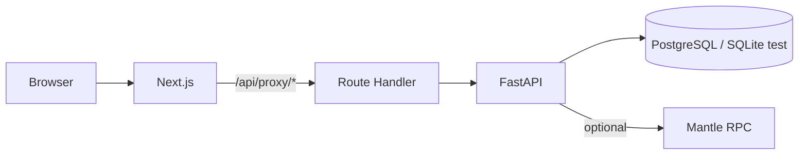

# TreasuryOS — Consultation Pack (send this file + screenshots)

**Never attach** `apps/api/.env`, `packages/contracts/.env`, or private keys.

---

## 1. Project structure (monorepo)

```
TreasuryOS/
├── README.md
├── .github/workflows/ci.yml    # API pytest on push/PR
├── apps/
│   ├── api/
│   │   ├── app/                # FastAPI, routes, services
│   │   ├── alembic/            # 001_initial (idempotent for existing DBs)
│   │   ├── tests/              # pytest e2e constitutional flow (SQLite)
│   │   ├── requirements.txt  # + pytest, httpx
│   │   └── .env.example        # includes Mantle mainnet vars (public)
│   └── web/                    # Next.js 15 (App Router)
│       ├── app/api/proxy/      # runtime proxy → FastAPI (BACKEND_API_URL / default demo)
│       ├── next.config.ts      # standalone, CSP headers — no /api/* rewrite (see section 8)
│       ├── Dockerfile
│       └── package.json
├── packages/contracts/         # Hardhat: VaultRegistry, ConstitutionRegistry, ExecutionLog
│   └── script/deploy.js        # scrie deployments/<network>.json + hint variabile API
└── infra/compose.yml           # optional: local Postgres + Redis
```

---

## 2. Dashboard — screenshots (you take them, 2 minutes)

**I can’t generate real UI pixels here**; open in your browser and take 3–4 PNG screenshots:

| # | Live URL | What to capture |
|---|----------|-----------------|
| 1 | `https://treasuryos-web-production.up.railway.app/` | Landing + live capital map |
| 2 | `https://treasuryos-web-production.up.railway.app/dashboard` | Mission control: survivability, integrity, topology, feed |
| 3 | `https://treasuryos-web-production.up.railway.app/demo` | Crisis simulator sequence |
| 4 | `https://treasuryos-web-production.up.railway.app/constitution` | Law sliders + commit |

Local: `cd apps/web && npm run dev` → `http://localhost:3000/dashboard`.

Attach files named: `01-landing.png`, `02-dashboard.png`, etc.

---

## 3. Key dependencies (for audit)

- **Frontend:** see `apps/web/package.json` — Next 15.x, React 19.x, Recharts, Zustand, Framer Motion.
- **Backend:** see `apps/api/requirements.txt` — FastAPI, SQLAlchemy, Alembic, psycopg, web3, redis (optional), pytest + httpx (tests).

---

## 4. Backend architecture

- **Framework:** FastAPI, `uvicorn`.\n+- **Config:** `app/config.py` — `APP_ENV`, `DATABASE_URL`, `CORS_ALLOW_ORIGINS`, `REDIS_URL`, Mantle vars for optional on-chain logging.\n+- **Lifecycle:** `lifespan` in `main.py` — runs `alembic upgrade head` first (subprocess, `cwd` = `apps/api`), then optional `create_all` + runtime column patch when `AUTO_CREATE_SCHEMA` (dev/test). **`/health` only responds after migrations succeed** — Railway healthcheck depends on DB.\n+- **DB:** PostgreSQL (Railway/prod), SQLAlchemy 2. The initial migration `001_initial_schema` is **idempotent** (skips `CREATE TABLE` when tables already exist — the \"legacy create_all without alembic_version\" case).\n+- **Routes:** vaults, proposals (evaluate, execution-record), simulations, monitoring (ledger, health, Redis decisions).\n+- **Domain:** `constitution_engine.py` — deterministic ALLOW/REJECT; `blockchain.py` — Mantle + `ExecutionLog` contract when RPC + address + signer configured.\n+- **Contracts:** `packages/contracts` — Hardhat deploy to `mantle` / `mantleSepolia`; local `deployments/mantle.json` (gitignored by policy).



---

## 5. Mantle mainnet — contracts (public on-chain data)

**Verified** (`eth_getCode` / deploy Hardhat, chain id **5000**):

| Contract | Address |
|----------|---------|
| VaultRegistry | `0x3FC68d6e16327594FA79e1dE4f5FDf3FC9b8b94D` |
| ConstitutionRegistry | `0x7e31a6Ad9BB606155a78eaEA80C3Ef15eECA426d` |
| ExecutionLog (folosit de API pentru tx-uri) | `0xA22ebFf573BedA62202490A87eCE31C7c91462b9` |

**How a third party verifies:** `POST` to a Mantle RPC (e.g. `https://rpc.mantle.xyz`) using `eth_getCode` + address + `latest` — the result should be non-empty bytecode (not just `0x`).

Minimal API vars for logging: `MANTLE_RPC_URL`, `MANTLE_CHAIN_ID=5000`, `EXECUTION_LOG_CONTRACT` (address above), and `TREASURY_EXECUTOR_PRIVATE_KEY` or mnemonic (secret — never in repo). Examples in `apps/api/.env.example`.

---

## 6. CI and automated tests

- **GitHub Actions:** `.github/workflows/ci.yml` — on push/PR to `main`/`master`, runs `python -m pytest tests/` in `apps/api` (SQLite + Alembic in test lifespan).\n+- **Local:** `cd apps/api && python -m pip install -r requirements.txt && python -m pytest tests/ -v`

**How a third party verifies:** open the repo on GitHub → **Actions** tab → latest **CI** workflow is green for the latest push.

---

## 7. Roadmap (README) — status

1. ~~Alembic pe startup~~  
2. ~~Redis event feed + monitoring~~  
3. ~~Simulări Recharts + Framer pe `/simulations`~~  
4. ~~Contracte + deploy Mantle + integrare env API~~  
5. ~~Teste e2e flow constituțional + CI~~  

---

## 8. Railway — operational lessons

- **Backend (`treasuryos-backend`):** Git source with **Root Directory `apps/api`**. Postgres in the same project; `DATABASE_URL` references the Postgres service. Incident: `DuplicateTable` on first migration when tables existed but `alembic_version` was missing — fixed by making `001_initial_schema` idempotent. Healthcheck in `apps/api/railway.json`: `/health`, timeout increased (300s) to cover cold-start migrations.\n+- **Frontend (`treasuryos-web`):** Root Directory `apps/web`, Dockerfile build. **Fixed incident:** a blanket `/api/*` rewrite in `next.config.ts` sent `/api/proxy/*` to localhost in production, causing 500s. The rewrite was removed; API traffic goes through `app/api/proxy/[...path]/route.ts`.\n+- **Git push auth:** a global `GITHUB_TOKEN` with limited permissions can cause HTTPS push 403 — clear it for interactive pushes or use SSH.

After each fix on `main`, redeploy the affected services if auto-deploy is not active or shows \"Auto deploy unavailable\".

---

## 9. What to verify live (HTTP)

| Resource | URL / action | Expected |
|---------|----------------|-------------|
| API health | `GET https://treasuryos-backend-production.up.railway.app/health` | **200**, `{"status":"ok","service":"treasuryos-api"}` |
| Web | `GET https://treasuryos-web-production.up.railway.app/` | **200** |
| Proxy → API | `GET https://treasuryos-web-production.up.railway.app/api/proxy/health` | **200**, same JSON as API direct (requires the web deploy after the rewrite fix; see section 8) |

UI flow: **Dashboard → Activate constitutional vault** — creates vault + proposal + health; Mantle is optional until **Attest action** without `tx_hash` (then blockchain env is required).

**Assumption:** URL-urile Railway de mai sus rămân cele ale proiectului; dacă se schimbă domeniile, înlocuiește-le în verificări.

---

## How to send the pack

1. This file: `CONSULTATION_PACK.md`\n+2. Folder with **screenshots** (section 2)\n+3. Optional: include `apps/web/package.json` and `apps/api/requirements.txt` if they want version details
